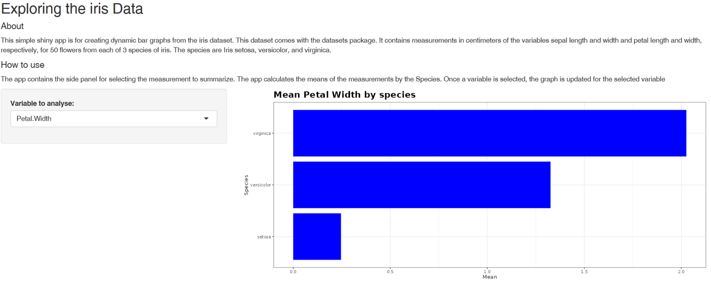

```{r setup, include=FALSE}
knitr::opts_chunk$set(echo = FALSE)
library(tidyverse)
```

## 

### About

This [shiny app](https://twes.shinyapps.io/shinyDataProduct/) is for creating dynamic bar graphs from the iris dataset.

This app contains the:

-   side panel for selecting the measurement to summarize,
-   Main panel for calculating the means of the measurements by the Species and displaying the results in form of a bar graph.

## The side bar and the main panel

With the **Variable to analyse**, panel, select the variable of interest, then the graph is updated for that selected variable in the main panel.

```{r echo=FALSE, out.width = "80%", fig.align = "center"}

```


## The code for Sepal.Length by Species

```{r code, echo = TRUE, eval = FALSE}
df_means <- iris %>% 
        group_by(Species) %>% 
        summarise(Mean = mean(Sepal.Length))

ggplot(data = df_means, aes(x = Mean, y = Species)) +
        geom_col(fill = "blue") +
        theme_bw() +
        labs(title = "Mean Sepal Length by species")+
        theme(plot.title=element_text(family='', face='bold', size=18))

```

## Bar graph for Sepal.Length by Species

```{r graph, echo = FALSE}
df_means <- iris %>% 
        group_by(Species) %>% 
        summarise(Mean = mean(Sepal.Length))

ggplot(data = df_means, aes(x = Mean, y = Species)) +
        geom_col(fill = "blue") +
        theme_bw() +
        labs(title = "Mean Sepal Length by species")+
        theme(plot.title=element_text(family='', face='bold', size=18))

```
